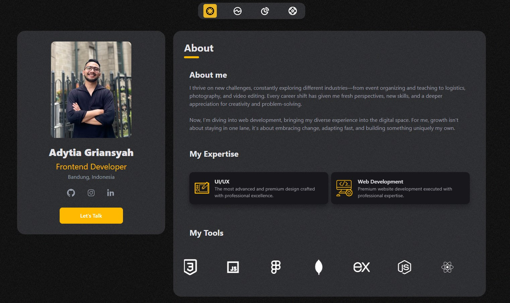
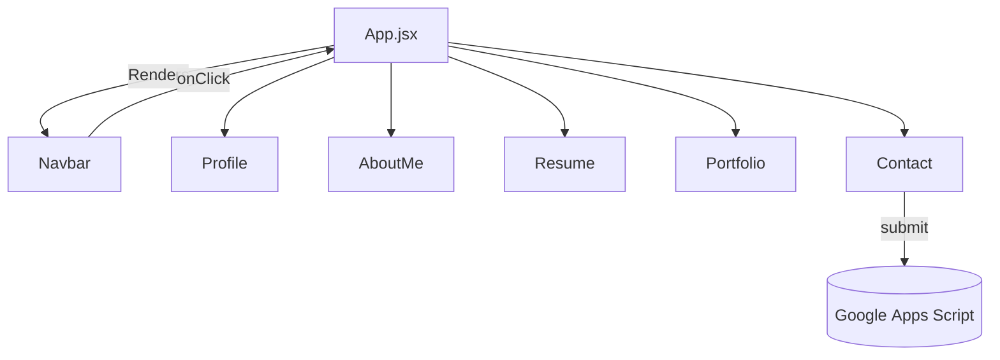

# Portfolio — Adytia Griansyah





A responsive single‑page portfolio application built with **React**, **Vite**, and **Tailwind CSS** that showcases my profile, resume, projects, and contact form — complete with smooth scrolling animations powered by **Framer Motion**.

## Table of Contents

- [Features](#features)
- [Tech Stack](#tech-stack)
- [Architecture](#architecture)
- [Getting Started](#getting-started)
- [Folder Structure](#folder-structure)
- [Deployment](#deployment)
- [License](#license)
- [Contact](#contact)

## Features

- **Component‑driven SPA** — navigate between sections without page reloads.
- **Animated Navigation** — smooth scrolling & section transitions with Framer Motion.
- **Profile Card** with social links & “Let’s Talk” CTA.
- **About Me** section with tool marquee.
- **Resume** timeline (education & experience).
- **Portfolio** grid with hover animations.
- **Contact** section with embedded Google Map & form (Google Apps Script backend).
- Fully **responsive** & dark‑mode friendly.

## Tech Stack

| Category   | Tools                                       |
| ---------- | ------------------------------------------- |
| Front‑end  | React 18, Vite, Tailwind CSS, Framer Motion |
| State      | React `useState`, `useRef`                  |
| Icons      | React‑Icons                                 |
| Forms      | Google Apps Script (REST)                   |
| Deployment | Vercel                                      |

## Architecture



### State Management

`App.jsx` holds global UI state:

```js
const [activeSection, setActiveSection] = useState('about');
const [activeNav, setActiveNav] = useState('about');
const [showAlert, setShowAlert] = useState(false);
const [formLoading, setFormLoading] = useState(false);
```

### Animations

- **AnimatePresence** wraps page transitions.
- `motion.div` components drive element fades, slides & staggers.


## Getting Started

### Prerequisites

- **Node.js ≥ 18**
- **pnpm** / **npm** / **yarn**

### Installation

```bash
# 1. Clone the repo
git clone https://github.com/Adytia855/Portfolio.git
cd Portfolio

# 2. Install dependencies
npm install              # or pnpm install

# 3. Start dev server
npm run dev
```

Open [http://localhost:5173](http://localhost:5173) to view the app in your browser.

### Build for Production

```bash
npm run build            # build to /dist
npm run preview          # serve production build locally
```

## Folder Structure

```text
├── public/             # Static assets
├── src/
│   ├── components/     # Reusable UI pieces
│   ├── sections/       # AboutMe, Resume, Portfolio, Contact
│   ├── App.jsx         # Root component & state
│   ├── main.jsx        # Entry point
│   └── index.css       # Tailwind directives
├── vite.config.js
└── tailwind.config.js
```

## Deployment

The project is automatically deployed via **Vercel** on every push to `main`.

> **Production URL:** [https://portfolio-one-smoky-47.vercel.app/](https://portfolio-one-smoky-47.vercel.app/)

Want to self‑deploy?

```bash
npm run build
# then deploy /dist with any static host (Vercel, Netlify, GitHub Pages, etc.)
```


## License

Distributed under the **MIT License**. See `LICENSE` for more information.

## Contact

**Muhammad Adytia Griansyah**\
🌐 [https://portfolio-one-smoky-47.vercel.app/](https://portfolio-one-smoky-47.vercel.app/)\
🐦 [@adytgriansyah](https://twitter.com/adytgriansyah)\
📧 [your.email@example.com](mailto\:your.email@example.com)

---

> Built with ❤️ using React & Tailwind CSS

